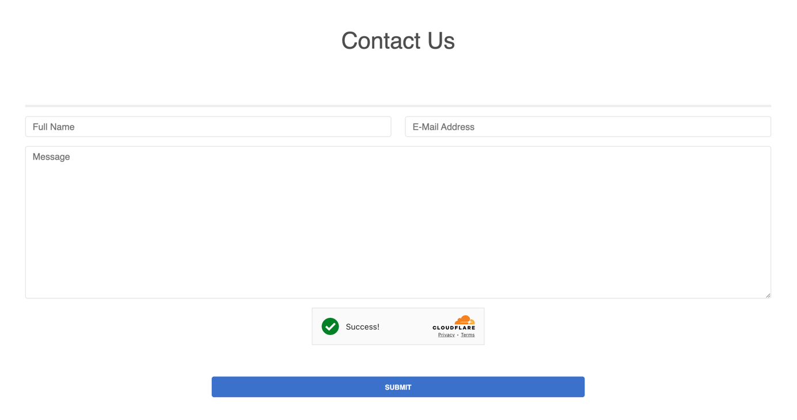
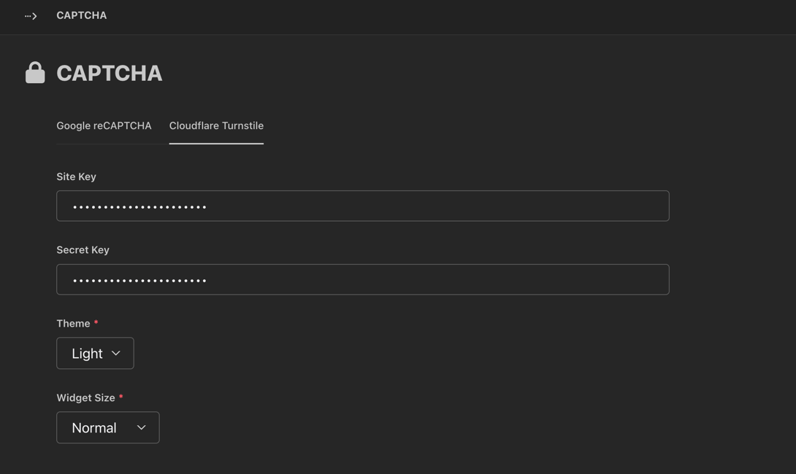

# Wagtail Contact Form

## Description

> [!NOTE]
> The project supports `Django 5` and `Wagtail 6`.

> [!NOTE]
> The project supports `Google reCAPTCHA` and `Cloudflare Turnstile`.

A very basic contact form with `CAPTCHA` module that protects you against spam.

 

   

 

> [!NOTE]
> `Google reCAPTCHA V3` is now supported, while `Google reCAPTCHA V2` is deprecated.

## Authors

[Filip Woźniak](https://github.com/FilipWozniak)