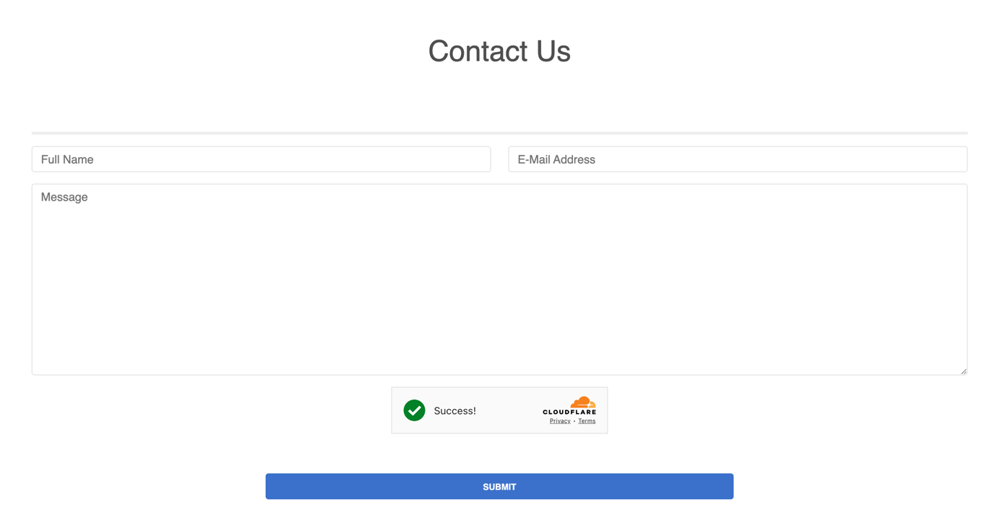
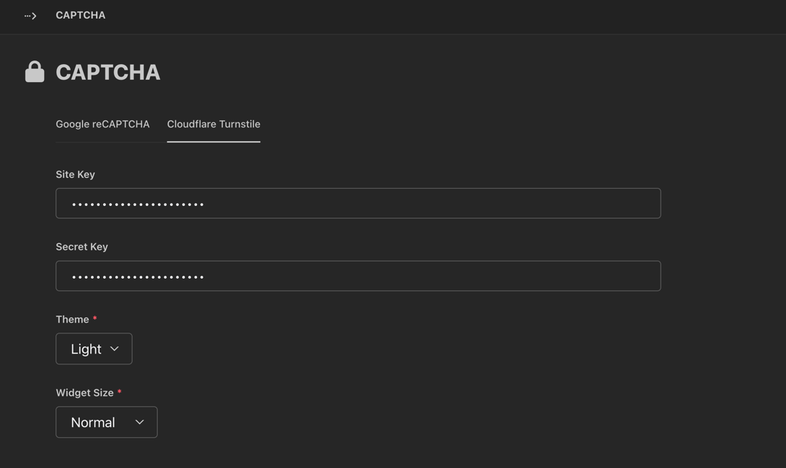

# Wagtail Contact Form

## Description

A very basic contact form with `CAPTCHA` module that protects you against spam.

> [!NOTE]
> The project supports `Django 6` and `Wagtail 8`.

> [!NOTE]
> The project supports `Google reCAPTCHA` and `Cloudflare Turnstile`.

> [!NOTE]
> If your website uses a `Content-Security-Policy`, allow your `CAPTCHA` provider as described in
> [Configuration](README/Configuration.md).

 

   

 

> [!NOTE]
> `Google reCAPTCHA V3` is now supported, while `Google reCAPTCHA V2` is deprecated.

### [Installation](README/Installation.md)

### [Configuration](README/Configuration.md)

### [Common Issues](README/Common%20Issues.md)

### [Testing](README/Testing.md)

## Authors

[Filip Woźniak](https://github.com/FilipWozniak)
