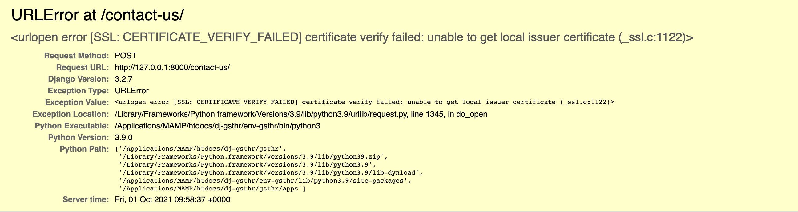

# Common Issues

### `CERTIFICATE_VERIFY_FAILED`

If you are using `MacOS` you may encounter `URLError` while trying to submit the form.

```shell
URLError at /contact-us/
[SSL: CERTIFICATE_VERIFY_FAILED] Certificate Verify Failed
```



So, to resolve this issue, please navigate to `Macintosh HD` > `Applications` > `Python` and double-click on
`Install Certificates.command`, as described in
this [thread](https://stackoverflow.com/questions/50236117/scraping-ssl-certificate-verify-failed-error-for-http-en-wikipedia-org).

### `Content-Security-Policy`

If the form shows `We could not load the security check. Please try again.` or the `CAPTCHA` never appears, the `Content-Security-Policy` is most likely blocking the `CAPTCHA` provider. Please add the sources listed in `Step 4` of
[Configuration](Configuration.md) to the `local.py` and reload the page.
